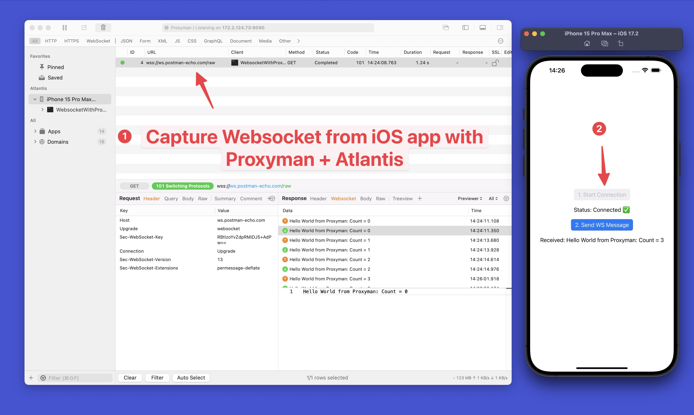

### Websocket iOS app with Proxyman
This iOS app demonstrates how Proxyman app can capture WS/WSS traffic from URLSessionWebsocketTask from iOS 16, 17 by using Atlantis Framework: https://github.com/ProxymanApp/atlantis

### How to use
1. Open Proxyman for macOS
2. Start this Project by Xcode on iOS Simulator or iOS Devices
3. Click on `Start Connection` button, then `Send Message` btn
3. Done ✅ Proxyman can capture Websocket Traffic.

### Screenshot

